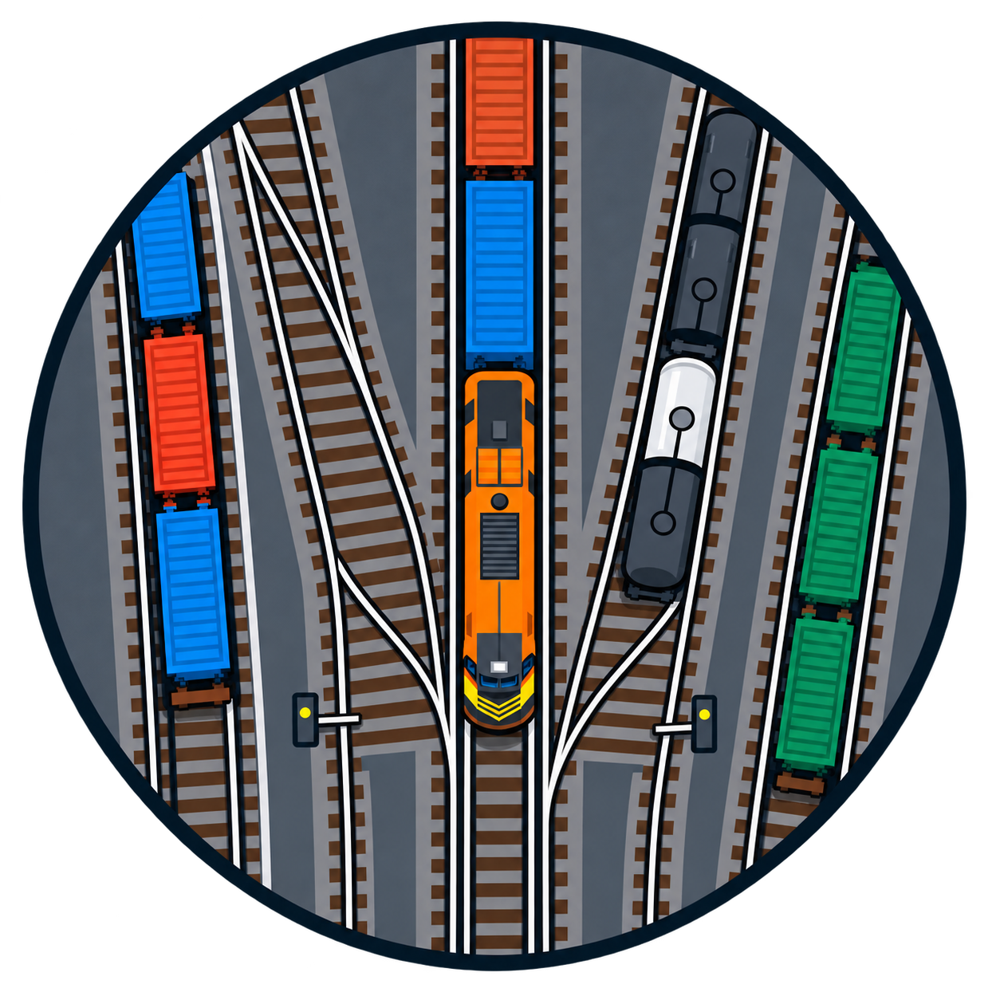
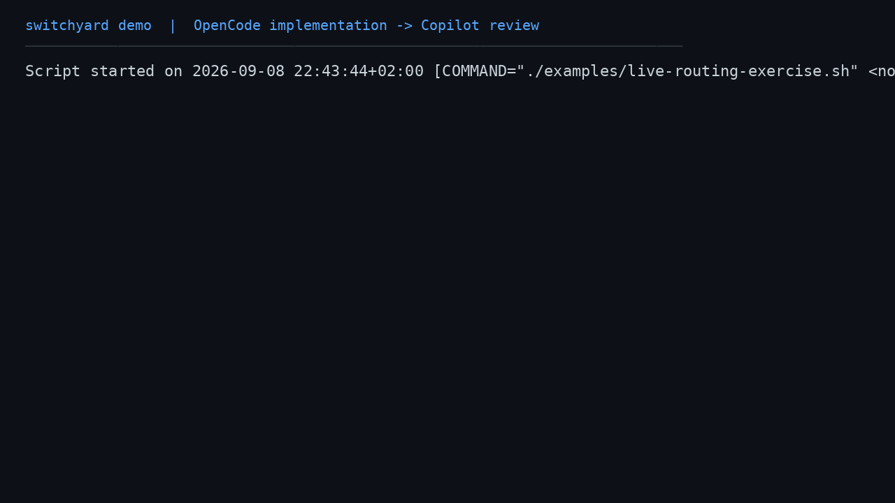

<div align="center">



# Switchyard

**Capability-driven routing for local coding-agent harnesses**

[](https://nodejs.org/)
[](https://www.typescriptlang.org/)
[](tests/)

[Features](#features) · [Getting started](#getting-started) · [CLI workflow](#cli-workflow) · [Configuration](#configuration) · [Workflow composition](#workflow-composition) · [Development](#development)

</div>

Switchyard is a local, cross-platform TypeScript toolkit for discovering coding-agent harnesses, normalizing their capabilities, and routing work to a suitable harness. It treats **capabilities**, rather than vendor identity, as the orchestration contract.

Routing is deterministic and explainable: requirements are matched explicitly, preferred-harness fallback is opt-in, verification is separate from discovery, and subprocess execution is bounded and cancellation-aware.

> [!NOTE]
> Switchyard is currently a private development package. The built-in OpenCode
> and GitHub Copilot adapters support bounded prompt execution. OpenCode's
> advertised `fork` capability can be used for capability-based routing, but
> verification, resume, and the dedicated fork lifecycle operation remain
> unsupported.

## Current status

The current release slice includes discovery schemas, executable lookup,
bounded version/help probing, local registry persistence, capability matching,
deterministic routing, verification policy, safe process execution, typed
configuration, workflow composition, stable JSON output, and explicit adapter
registration. OpenCode and GitHub Copilot discovery are included; execution
support for prompts is available through their non-interactive provider modes.

## Features

- **Harness discovery** — Locate configured OpenCode and GitHub Copilot executables, probe bounded version/help output, and persist a local registry.
- **Normalized capabilities** — Compare harnesses using a shared capability vocabulary instead of vendor-specific flags.
- **Provider feature inventory** — Preserve structured provider commands, options, providers, and help topics alongside normalized routing capabilities.
- **Deterministic routing** — Require every requested capability, rank qualifying candidates consistently, and explain each decision.
- **Explicit fallback policy** — A preferred harness must qualify; fallback to another candidate happens only when enabled.
- **Verification-aware selection** — Run bounded, policy-controlled probes and keep verification evidence separate from discovery evidence.
- **Safe execution runtime** — Use direct argument arrays, controlled working directories and environments, output bounds, timeouts, cancellation, and redacted diagnostics.
- **Workflow composition** — Execute dependency-ordered stages with workspace-contained artifacts and explicit, sanitized handoffs.
- **Session lifecycle commands** — Resume OpenCode and Copilot sessions and fork OpenCode sessions from the CLI.
- **Stable automation contracts** — Consume versioned JSON results and stable exit categories from scripts and CI.
- **Adapter extensibility** — Register new harness adapters without changing matching, routing, or registry logic.

## Getting started

### Requirements

- [Node.js](https://nodejs.org/) 24 or newer
- npm
- At least one supported harness executable when refreshing discovery

Check your runtime before installing:

```sh
node --version
npm --version
```

### Install

Clone the repository, enter the project directory, and install dependencies:

```sh
git clone https://github.com/McFuzzySquirrel/switchyard.git
cd switchyard
npm install
```

If you use `nvm`, select Node 24 or newer before running npm commands:

```sh
nvm install 24
nvm use 24
```

### First discovery

Run the CLI from this private repository checkout:

```sh
npm run switchyard -- discover
```

The examples below use the installed-package form `npx switchyard`. From this
checkout, use `npm run switchyard --` as the command prefix instead.

The first discovery creates a per-user registry snapshot. Refresh it after
installing or changing a harness:

```sh
npm run switchyard -- discover --refresh --json
```

Use `--registry ./registry.json` for a project-local or CI-specific snapshot.

## CLI workflow

### Inspect capabilities

`capabilities` reads the registry and never launches a harness:

```sh
npx switchyard capabilities
npx switchyard capabilities --verified
npx switchyard capabilities --json
```

### Explain a routing decision

Requirements are all-required: a candidate must positively match every
capability:

```sh
npx switchyard explain --requires=headless,repository-access
npx switchyard explain --requires=headless --json
```

Prefer a particular harness without silently using another:

```sh
npx switchyard explain \
  --requires=headless \
  --preferred-harness=opencode
```

Opt into fallback explicitly:

```sh
npx switchyard explain \
  --requires=headless \
  --preferred-harness=opencode \
  --allow-fallback
```

The explanation includes matched and missing capabilities, discovery and
verification state, ranking inputs, policy attempts, and the selection reason.

### Run an agent prompt

`prompt` is the task-focused alias for `run`:

```sh
npx switchyard prompt \
  "Inspect the failing tests and explain the first fix."
```

In an interactive terminal, omitting `--requires` presents one consolidated
checkbox-style list of discovered normalized capabilities. Select the
capabilities the prompt needs; provider names stay out of the selection step.
For scripts, CI, JSON output, and non-TTY use, pass `--requires` explicitly.

Preview selection before launching the provider:

```sh
npx switchyard prompt \
  --requires=headless \
  --dry-run \
  --json \
  "Inspect the failing tests and explain the first fix."
```

### Run a task

```sh
npx switchyard run \
  --requires=headless \
  "fix the failing test"
```

Control the working directory and execution timeout:

```sh
npx switchyard run \
  --requires=headless \
  --cwd ./my-repository \
  --timeout-ms 120000 \
  "run the test suite and fix the first failure"
```

Resume an existing provider session:

```sh
npx switchyard resume \
  --harness=opencode \
  --session=<session-id> \
  "continue the implementation"
```

Fork an OpenCode session into a new session:

```sh
npx switchyard fork \
  --harness=opencode \
  --session=<session-id> \
  "try an alternative implementation"
```

Copilot supports `resume`; its dedicated `fork` operation is unavailable.

For a complete live exercise that routes an implementation prompt to OpenCode
and a review prompt to GitHub Copilot in a disposable workspace, see the
[Live Routing Exercise](docs/examples/live-routing-exercise.md) and its
[replayable script](examples/live-routing-exercise.sh).

To see a capability-only routing decision select OpenCode, run the
[Fork Capability Routing Exercise](docs/examples/fork-capability-routing.md).
Both exercises also include terminal-style [GIF and MP4 recordings](docs/examples/media/).




Preview a request without resolving or invoking an adapter:

```sh
npx switchyard run \
  --requires=headless \
  --dry-run \
  --json \
  "fix the failing test"
```

### Verify capabilities

Verification runs bounded probes for capabilities already observed in the
registry and persists the result:

```sh
npx switchyard verify \
  --harness=opencode \
  --capability=headless \
  --capability=repository-access \
  --json
```

Read-only probes are allowed by default. Risky probes require both a declared
risk and matching approval:

```sh
npx switchyard verify \
  --harness=opencode \
  --capability=external-access \
  --risk=external-access \
  --allow-external-access
```

Supported risk classes are `read-only`, `mutating`, `external-access`, `paid`,
and `model-invoking`. Approval flags are `--allow-mutating-probes`,
`--allow-external-access`, `--allow-paid-probes`, and
`--allow-model-invocation`.

### Commands at a glance

| Command | Purpose | Launches a harness? | Updates local state? |
| --- | --- | :---: | :---: |
| `discover` | Probe configured harnesses and update the registry | Yes, for bounded probes | Yes |
| `capabilities` | Read normalized capability profiles | No | No |
| `explain` | Explain deterministic selection | No | No |
| `run` | Route and execute a task | Yes, unless `--dry-run` | No registry update |
| `verify` | Run selected capability probes | Yes, when supported | Yes |
| `compose` | Execute a declared multi-stage workflow | Yes, when supported | Yes |

Run `npm run switchyard -- --help` for the complete option list. Once
Switchyard is published and installed as a package, the equivalent command is
`npx switchyard --help`.

## Configuration

Switchyard accepts a typed JSON configuration file. Select it explicitly:

```sh
npx switchyard discover --config ./switchyard.config.json
```

Or set `SWITCHYARD_CONFIG_PATH`. A minimal configuration looks like this:

```json
{
  "schemaVersion": 1,
  "registryPath": "./switchyard-registry.json",
  "harnesses": {
    "opencode": {
      "executable": "/opt/opencode/bin/opencode"
    },
    "copilot": {
      "probePolicy": {
        "timeoutMs": 8000
      }
    }
  }
}
```

Supported settings include:

- `registryPath`
- `harnesses.<id>.executable`
- `probePolicy.timeoutMs`
- `probePolicy.maxOutputLength`
- `probePolicy.allowMutatingProbes`
- `probePolicy.allowExternalAccess`
- `probePolicy.allowPaidProbes`
- `probePolicy.allowModelInvocation`

Configuration precedence is consistent across executable, timeout, output
limit, and probe-policy settings:

1. Explicit command or API value
2. Environment variable
3. Configuration file
4. Built-in default

Useful environment variables include `SWITCHYARD_REGISTRY_PATH`,
`SWITCHYARD_OPENCODE_EXECUTABLE`, `SWITCHYARD_COPILOT_EXECUTABLE`,
`SWITCHYARD_PROBE_TIMEOUT_MS`, and
`SWITCHYARD_PROBE_MAX_OUTPUT_LENGTH`. Harness-specific variables use the
`SWITCHYARD_<HARNESS>_...` form.

## Workflow composition

`compose` executes a declared JSON workflow in dependency order:

```sh
npx switchyard compose \
  ./examples/opencode-to-copilot.workflow.json \
  --json
```

Each workflow can declare:

- A workspace root and stable workflow ID.
- Stage dependencies and capability requirements.
- Workspace-contained file or directory outputs.
- Explicit stage inputs that consume one declared artifact and approved context.

Only declared handoff metadata is forwarded to the next stage. Undeclared
conversation state, stdout, stderr, environment variables, and arbitrary
artifacts are not transferred. Path containment and artifact kind are checked
again when a receiving stage consumes an output.

The included example models an implementation stage followed by a review stage:

```text
implementation (OpenCode)
        │ patch.diff + status context
        ▼
review (GitHub Copilot)
```

Workflow state is persisted atomically in
`switchyard-workflow-state.json`. If a later stage fails, earlier successful
results remain available and the command reports a `partial` result.

## Output and exit codes

Use `--json` for scripts and CI. JSON output uses a versioned
`schemaVersion: 1` envelope with stable `command` and `status` fields. Human
output is intended for interactive use. Diagnostics and captured output are
bounded and redacted before they are emitted.

| Code | Category | Meaning |
| ---: | --- | --- |
| `0` | `success` | The command completed successfully, including a dry run |
| `1` | `partial` | Some refresh operations or workflow stages failed |
| `2` | `invalidInput` | Arguments or input failed validation |
| `3` | `failure` | A command or selected execution failed |
| `4` | `noMatch` | No harness satisfied all requirements |
| `5` | `unavailable` | The selected harness cannot execute the request |

## Library and adapter development

The package exports TypeScript contracts from the root and subpaths:

```ts
import {
  matchRequiredCapabilities,
  selectBestCapabilityMatch,
  validateTaskRequirements,
} from "switchyard";
```

Public subpaths include `switchyard/capabilities`, `switchyard/commands`,
`switchyard/composition`, `switchyard/config`, `switchyard/discovery`,
`switchyard/harness`, `switchyard/output`, and `switchyard/verification`.

Implement a new integration behind the vendor-neutral `HarnessAdapter` or the
narrower `HarnessDiscoveryAdapter` contract. Register the constructed adapter
explicitly with the existing registry; do not add vendor branches to routing or
matching. Unsupported operations must fail before a subprocess is launched.

See the [Adapter Development Guide](docs/adapter-development.md) for the
operation contract, registration pattern, configuration resolution, testing
requirements, and security expectations.

## Development

Run the existing project checks:

```sh
npm install
npm run typecheck
npm test
npm run test:docs
```

The test suite uses Node's built-in test runner and TypeScript's
`--experimental-strip-types` support. The repository currently contains unit,
integration, process-execution, adapter-conformance, workflow-composition, and
documentation-governance coverage.

## Documentation

- [User Guide](docs/user-guide.md) — complete CLI, configuration,
  verification, workflow, troubleshooting, and library usage reference.
- [Adapter Development Guide](docs/adapter-development.md) — build and test
  harness integrations.
- [OpenCode-to-Copilot workflow example](examples/opencode-to-copilot.workflow.json)
  — a complete multi-stage workflow definition.
- [Live routing exercise](docs/examples/live-routing-exercise.md) — a recorded
  two-provider prompt execution scenario.
- [Fork capability routing exercise](docs/examples/fork-capability-routing.md)
  — a recorded capability-specific routing scenario.
- [Terminal demo recorder](examples/record-terminal-demos.sh) — regenerate
  live GIF and MP4 recordings from both exercises.
- [Product requirements](docs/PRD.md) — product goals and scope.
- [Architecture decision records](docs/adr/) — rationale for public contracts
  and execution boundaries.
