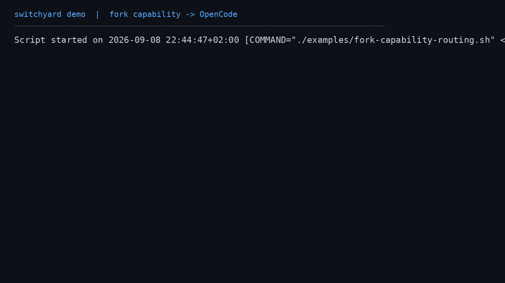

# Fork Capability Routing Exercise

This exercise shows that a normalized capability requirement can determine the
selected harness. It requests `fork`, a capability advertised by OpenCode but
not by the other built-in provider profile, then executes a safe inspection
prompt through the selected OpenCode adapter.

> [!NOTE]
> In this exercise, `fork` is used as a routing requirement. The selected
> adapter executes the prompt through its supported `execute` operation; it
> does not invoke the separate `fork` lifecycle operation. The built-in
> OpenCode adapter advertises fork-related capability support for routing, but
> its dedicated `fork` operation remains unsupported.

## Run the exercise

Prerequisites:

- Node.js 24 or newer
- OpenCode installed and authenticated
- Dependencies installed in the repository checkout

From the repository root:

```sh
./examples/fork-capability-routing.sh
```

The script creates a temporary workspace containing one text file, refreshes
discovery, requires `fork`, and runs a read-only inspection prompt. It verifies
that Switchyard selects OpenCode, that execution succeeds, and that the
workspace is unchanged.

## Terminal recording



The recording is intentionally slowed so the routing decision and execution
result are easier to follow.

- [Download the MP4 recording](media/fork-capability-routing.mp4)
- [Replay the exercise](../../examples/fork-capability-routing.sh)

Both this recording and the two-provider recording can be regenerated with:

```sh
./examples/record-terminal-demos.sh
```

## Recorded result

The live run completed with OpenCode `1.18.28`:

```text
opencode: available (1.18.28)
fork: observed
selected=opencode
requirements=fork
execution=succeeded
```

The provider reported the contents of `routing-notes.txt` and made no file
changes. The important routing result is that `--requires=fork` selected
OpenCode without requiring the user to pass `--preferred-harness=opencode`.

## What this proves

- A provider-specific help surface can contribute a normalized `fork`
  capability.
- The normalized requirement is matched before execution.
- A capability requirement can select the correct harness even when the task
  itself is ordinary prompt execution.
- `--cwd` keeps the execution inside a disposable workspace.
- The routing requirement and the adapter operation are separate contracts:
  capability matching can succeed even when a dedicated lifecycle operation is
  not available.

For a two-provider implementation/review workflow, see the
[Live Routing Exercise](live-routing-exercise.md).
